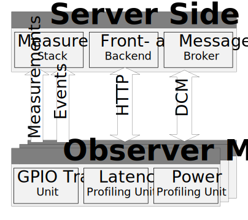

# D-Cube: A Benchmark for Low-Power Wireless Systems

D-Cube is a full-fledged benchmarking infrastructure that provides a consistent way to evaluate the performance of low-power wireless systems. Hosted at the Institute of Technical Informatics of Graz University of Technology, D-Cube supports the automated testing of the reliability, timeliness, and energy consumption of low-power wireless communication protocols in a variety of settings. The primary audience of D-Cube are academic researchers and industry practitioners creating low-power wireless networking solutions that would like to quantitatively assess and compare their performance with that of other systems addressing the same class of applications.  

D-Cube is fully open source with the software licensed under the MIT License and PCB design files under Creative Commons Attribution Share Alike 4.0 International.  

This site serves as a quickstart guide to setup a new D-Cube instance using the provided source.  

## Architecture

To install D-Cube on your local infrastrucutre, two components need to be set up:
* The *Server-Side Components* responsible for user interaction and orchestration of experiments
* The testbed infrastructure made up of *Observer Modules* (using Raspberry Pi 3B and one or both custom PCBs) instrumenting the *Target Nodes* (currently nRF52840DK and TelosB Sky nodes are supported)

