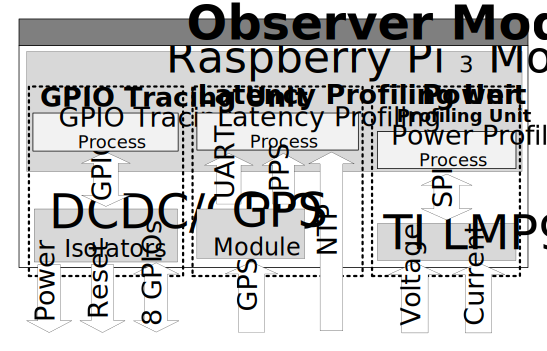

# Observer Module

Each Observer Module is based around a Raspberry Pi 3B and two custom PCBs:
* A measurement PCB (responsible for isolation of the target node, PoE power supply, asynchrnonous mailbox, and energy measurements)
* A target mux PCB (to use more than once target node per observer module, or for the nRF52840DK to enable switching between the Segger JLink interface and the native USB port)

To get started with the Observer Module, download the Raspberry Pi Image **TBD**. Write the provided image file to an SD card (e.g., using dd, etcher, or the official Raspberry Pi Imager).

## Requirements

Each Observer Module requires a unique hostname which must be changed after writing the image (changing /etc/hostname and /etc/hosts) to rpiXXX (where XXX is the number of the Pi).  

After flashing the first Observer Module, further changes for the local network are required. Each module needs to know the address of the server running the Server-Side Components, to this end the following files need to be adapted:
* /etc/chrony/chrony.conf (in case the ntp is running on the server, otherwise also add the IP of the Raspberry running the GSP module)
* /home/pi/dcm/rpc_pi.py (the Raspberry class needs to have the correct IP address of the broker/server)
* /home/pi/testbed/influx-emiter.py and /home/pi/testbed/i2c/influx-emiter.py use the server's IP in multiple locations

Afterwards, this new base image can be replicated and only the hostname/hosts needs to be changed per Pi.

## Architecture

The Observer Module is split into three (mostly) independent parts:
* The *GPIO Tracing Unit* constantly monitoring the Target Node's GPIOs with the ability to control them in blocks of 4 GPIOs (along with reset and power).
* The *Latency Profiling Unit* to enable synchrnoized measurements of the GPIOs across the testbed, GPS or NTP can be used.
* The *Power Profiling Unit* uses and external synchronous sampling ADC to measure voltage and current of the target node.

