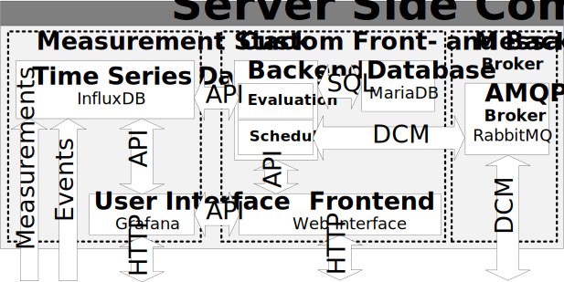

# Server-Side Components

To get started with the Server-Side Components, download the source by cloning [the github repository](https://github.com/TuGraz-ITI/D-Cube-Benchmark)

The Server-Side Components are intended to be run on a single central server with two networks:
* A public interface (with port 80 and/or 443 exposed for the web interface)
* An airgap network for the Observer Modules

While such a separation is not necessary for operation, it is still highly recommended. The easiest way to setup the server-side components is to use the provided docker-compose file. To do so, install and configure docker (or an alternative container engine like podman) and using docker-compose (or an equivalent tool) run 

```
docker-compose build #this builds the dcube-web container from the github repository
docker-compose up -d #this starts the services in the background
```

## Requirements

It is assumed that the server running D-Cube is located behind a reverse proxy (e.g., nginx) and/or firewall, as the container's ports for http, influxdb, and amqp are opened. This guide will **not** cover these basic steps. Further, it is recommended to run a dhcp server for the airgap network. A good starting point is to run dnsmasq on the central server along the server-side components. To ensure proper timesync, either the server or an Observer Module should act as ntp server using chrony.

## Architecture

The Server-Side Components are split into three (mostly) independent parts:
* The *Measurement Stack* using two containers for influxdb and grafana.
* The *Custom Front- and Backend* using two containers for dcube-web and a mysql/mariadb database.
* The *Message Broker* using a single container for rabbitmq.


